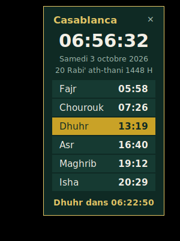

# Widget « Heures de prière » pour PC

Petit widget de bureau qui affiche les heures des cinq prières du jour, l'heure
actuelle, la date grégorienne et hégirienne, et un compte à rebours jusqu'à la
prochaine prière. Il fonctionne **hors-ligne** : les horaires sont calculés
astronomiquement à partir de la position (latitude / longitude).



## Fonctionnalités

- Fajr, Chourouk (lever du soleil), Dhuhr, Asr, Maghrib, Isha ; prochaine prière en surbrillance
- Compte à rebours en direct et changement automatique de jour à minuit
- Notification (avec son) à l'heure de chaque prière + rappel N minutes avant
- Son d'adhan personnalisé (fichier `.wav`, sous Windows)
- 14 méthodes de calcul : UOIF (12°), Grande Mosquée de Paris, Ligue Islamique Mondiale,
  Umm al-Qura, Maroc, Algérie, Tunisie, Égypte, ISNA, Turquie…
- Asr Standard ou Hanafi, gestion des hautes latitudes, ajustements manuels en minutes
  (pour coller aux horaires de votre mosquée)
- Fenêtre sans bordure, déplaçable, semi-transparente, « toujours au premier plan » au choix
- Lancement automatique à l'ouverture de session (Windows et Linux)
- Aucune dépendance : Python standard + Tkinter

## Installation

1. Installer [Python 3.9 ou plus](https://www.python.org/downloads/) (sous Windows, Tkinter est inclus ;
   sous Linux : `sudo apt install python3-tk`).
2. Télécharger ce dépôt (bouton **Code → Download ZIP**) et le décompresser.
3. Lancer le widget :
   - **Windows** : double-cliquer sur `PrayerWidget.pyw` (aucune console ne s'ouvre) ;
   - ou en ligne de commande : `python -m prayer_widget`.

> Sous Windows, si vous renseignez un fuseau horaire (ex. `Europe/Paris`) plutôt que de
> laisser vide, installez la base des fuseaux : `pip install tzdata`. Laisser vide utilise
> simplement l'heure du PC, ce qui convient dans la plupart des cas.

## Utilisation

- **Glisser** avec le clic gauche pour déplacer le widget (la position est mémorisée).
- **Clic droit** pour le menu : *Paramètres…*, *Toujours au premier plan*, *Notifications*,
  *Lancer au démarrage*, *Tester la notification*, *Quitter*.
- Dans *Paramètres*, choisissez une ville prédéfinie ou saisissez vos coordonnées
  (trouvables sur Google Maps : clic droit sur le lieu → les coordonnées s'affichent).

## Configuration

Les réglages sont enregistrés dans :

- Windows : `%APPDATA%\PrayerWidget\config.json`
- Linux : `~/.config/prayer_widget/config.json`

Principales clés : `latitude`, `longitude`, `timezone`, `method` (`France`, `France18`, `MWL`,
`Makkah`, `Morocco`, `Algeria`, `Tunisia`, `Egypt`, `ISNA`, `Turkey`, `Karachi`, `Gulf`,
`Tehran`, `France15`), `asr_factor` (1 = Standard, 2 = Hanafi), `adjustments` (minutes par
prière), `hijri_offset`, `reminder_minutes`, `sound_file`, `opacity`, `show_arabic`.

## Créer un exécutable `.exe` (optionnel)

```bash
pip install pyinstaller
pyinstaller --onefile --noconsole --name PrayerWidget PrayerWidget.pyw
```

L'exécutable se trouve ensuite dans `dist/PrayerWidget.exe`.

## Tests

```bash
python -m unittest
```

Les calculs sont vérifiés contre l'algorithme solaire de la NOAA (écart < 1 minute).

## Remarques

- Les horaires calculés peuvent différer de quelques minutes de ceux de votre mosquée locale,
  qui appliquent parfois des marges de précaution : utilisez les ajustements.
- La date hégirienne est calculée par l'algorithme tabulaire et peut différer d'un jour de
  l'observation du croissant : utilisez la *correction hégirienne*.
